# Olá, eu sou Hicham Tayfour!

Sou estudante de **Economia**, apaixonado por **matemática**, **programação**, **Machine Learning** e **Data Science**. Tenho experiência em **Python**, **R** e **LaTeX**, que utilizo em projetos acadêmicos, integrando análise de dados, modelagem estatística e automação de relatórios.

## 📊 Minhas Estatísticas no GitHub:

<div style="display: flex; flex-direction: row; justify-content: space-between;">
  
  
  
</div>

## 🧮 Tecnologias que Utilizo:


## 🌟 Gráfico de Atividades no GitHub:

[](https://github.com/ashutosh00710/github-readme-activity-graph)

## 🔗 Como Me Encontrar:

[](https://www.linkedin.com/in/hicham-tayfour-71275b228/)
[](https://twitter.com/Hic_Tayfour)
[](mailto:hichamt@al.insper.edu.br)
[](https://hic-tayfour.github.io)

## 🎮 Contribuições em Animação:

<picture align="center">
  <source media="(prefers-color-scheme: dark)" srcset="https://raw.githubusercontent.com/Hic-Tayfour/Hic-Tayfour/output/github-contribution-grid-snake-dark.svg">
  <source media="(prefers-color-scheme: light)" srcset="https://raw.githubusercontent.com/Hic-Tayfour/Hic-Tayfour/output/github-contribution-grid-snake-dark.svg">
  
</picture>

## 🌐 Estrutura dos Meus Repositórios

Aqui está um gráfico que descreve a estrutura dos meus repositórios e trabalhos acadêmicos:

### 1. Diagrama Principal - Repositórios

```mermaid
graph LR
    %% Definindo estilos personalizados para as caixas com base no tema "algolia"
    classDef reposit color:#fff, fill:#5468FF, stroke:#ffffff, stroke-width:2px;
    
    %% Definindo o GitHub como ponto de entrada
    HT[GitHub do Hicham] -->|Principal| R[Repositório de R]
    HT --> Py[Repositório de Python]
    HT --> Tex[Repositório de LaTeX]
    HT --> LB[Repositório de LittleBox]
    HT --> MK[Repositório de MyKaggle]
    
    %% Aplicando classes de estilo aos nós principais
    class HT reposit;
    class R,Py,Tex,LB,MK reposit;
```


### 2. Diagrama de Repositórios de R

```mermaid
graph LR
    %% Definindo estilos personalizados
    classDef reposit color:#fff, fill:#5468FF, stroke:#ffffff, stroke-width:2px;
    classDef subreposit fill:#004080, stroke:#5468FF, stroke-width:2px, color:#ffffff;
    classDef aps fill:#282828, stroke:#666, stroke-width:1px, color:#ffffff, font-style:italic;

    %% Grupo de Repositórios de R
    R[Repositório de R]
    R --> RCW[College Works]
    RCW --> ESTATI[Estatística I]
    ESTATI --> APS1_ESTATI[APS 1 - Estatística I]
    ESTATI --> APS2_ESTATI[APS 2 - Estatística I]
    
    RCW --> ESTATII[Estatística II]
    ESTATII --> APS1_ESTATII[APS 1 - Estatística II]
    ESTATII --> APS2_ESTATII[APS 2 - Estatística II]
    
    RCW --> ECON[Econometria]
    ECON --> APS1_ECON[APS 1 - Econometria]
    ECON --> APS2_ECON[APS 2 - Econometria]

    RCW --> ECONAVAN[Econometria Avançada]
    ECONAVAN --> APS1_ECONAVAN[APS 1 - Econometria Avançada]

    RCW --> MICROIV[Microeconomia IV]
    MICROIV --> APS1_MICROIV[APS 1 - Microeconomia IV]
    MICROIV --> APS2_MICROIV[APS 2 - Microeconomia IV]
    MICROIV --> APS3_MICROIV[APS 3 - Microeconomia IV]

    R --> RCT[College Studies]
    RCT --> ZR[Zerando o Livro de R em R]
    RCT --> R4DS[R for Data Science]

    %% Aplicando classes de estilo
    class R reposit;
    class RCW,RCT subreposit;
    class APS1_ESTATI,APS2_ESTATI,APS1_ESTATII,APS2_ESTATII,APS1_ECON,APS2_ECON,APS1_ECONAVAN,APS1_MICROIV,APS2_MICROIV,APS3_MICROIV aps;

    %% Adicionando links externos
    click R "https://github.com/Hic-Tayfour/R" "Acessar Repositório Principal"
    click RCW "https://github.com/Hic-Tayfour/R/tree/main/College%20Works" "Acessar College Works"
    click ESTATI "https://github.com/Hic-Tayfour/R/tree/main/College%20Works/Estatistica-I" "Acessar Estatística I"
    click APS1_ESTATI "https://github.com/Hic-Tayfour/R/tree/main/College%20Works/Estatistica-I/APS1" "Acessar APS 1 - Estatística I"
    click APS2_ESTATI "https://github.com/Hic-Tayfour/R/tree/main/College%20Works/Estatistica-I/APS2" "Acessar APS 2 - Estatística I"
    click ESTATII "https://github.com/Hic-Tayfour/R/tree/main/College%20Works/Estatistica-II" "Acessar Estatística II"
    click APS1_ESTATII "https://github.com/Hic-Tayfour/R/tree/main/College%20Works/Estatistica-II/APS1" "Acessar APS 1 - Estatística II"
    click APS2_ESTATII "https://github.com/Hic-Tayfour/R/tree/main/College%20Works/Estatistica-II/APS2" "Acessar APS 2 - Estatística II"
    click ECON "https://github.com/Hic-Tayfour/R/tree/main/College%20Works/Econometria" "Acessar Econometria"
    click APS1_ECON "https://github.com/Hic-Tayfour/R/tree/main/College%20Works/Econometria/APS1" "Acessar APS 1 - Econometria"
    click APS2_ECON "https://github.com/Hic-Tayfour/R/tree/main/College%20Works/Econometria/APS2" "Acessar APS 2 - Econometria"
    click ECONAVAN "https://github.com/Hic-Tayfour/R/tree/main/College%20Works/Econometria-Avancada" "Acessar Econometria Avançada"
    click APS1_ECONAVAN "https://github.com/Hic-Tayfour/R/tree/main/College%20Works/Econometria-Avancada/APS1" "Acessar APS 1 - Econometria Avançada"
    click MICROIV "https://github.com/Hic-Tayfour/R/tree/main/College%20Works/Microeconomia-IV" "Acessar Microeconomia IV"
    click APS1_MICROIV "https://github.com/Hic-Tayfour/R/tree/main/College%20Works/Microeconomia-IV/APS1" "Acessar APS 1 - Microeconomia IV"
    click APS2_MICROIV "https://github.com/Hic-Tayfour/R/tree/main/College%20Works/Microeconomia-IV/APS2" "Acessar APS 2 - Microeconomia IV"
    click APS3_MICROIV "https://github.com/Hic-Tayfour/R/tree/main/College%20Works/Microeconomia-IV/APS3" "Acessar APS 3 - Microeconomia IV"
    click RCT "https://github.com/Hic-Tayfour/R/tree/main/College%20Studies" "Acessar College Studies"
    click ZR "https://github.com/Hic-Tayfour/R/tree/main/College%20Studies/Zerando-o-Livro-de-R" "Acessar Zerando o Livro de R em R"
    click R4DS "https://github.com/Hic-Tayfour/R/tree/main/College%20Studies/R-for-Data-Science" "Acessar R for Data Science"

```


### 3. Diagrama de Repositórios de Python

```mermaid
graph LR
    %% Definindo estilos personalizados
    classDef reposit color:#fff, fill:#5468FF, stroke:#ffffff, stroke-width:2px;
    classDef subreposit fill:#004080, stroke:#5468FF, stroke-width:2px, color:#ffffff;
    classDef aps fill:#282828, stroke:#666, stroke-width:1px, color:#ffffff, font-style:italic;

    %% Repositórios de Python
    Py[Repositório de Python] --> PyCW[College Works]
    PyCW --> SI[Sistemas de Informação]
    SI --> APS1_SI[APS 1 - SI]

    PyCW --> FINI[Finanças I]
    FINI --> APS1_FINI[APS 1 - Finanças I]
    FINI --> APS2_FINI[APS 2 - Finanças I]

    PyCW --> MpD[Modelos para Tomada de Decisão]
    MpD --> APS1_MpD[APS 1 - Modelos para Tomada de Decisão]

    PyCW --> FINII[Finanças II]
    FINII --> APS1_FINII[APS 1 - Finanças II]

    PyCW --> FINIII[Finanças III]
    FINIII --> APS1_FINIII[APS 1 - Finanças III]

    Py --> PyCT[College Studies]
    PyCT --> MpTD[Modelos para Tomada de Decisão]
    MpTD --> DS[Dinâmica de Sistemas]
    MpTD --> ES[Simulação de Estoque]

    %% Aplicando classes de estilo
    class Py reposit;
    class PyCW,PyCT subreposit;
    class APS1_SI,APS1_FINI,APS2_FINI,APS1_MpD,APS1_FINII,APS1_FINIII aps;
```


### 4. Diagrama de Repositórios de LaTeX
```mermaid
graph LR
    %% Definindo estilos personalizados
    classDef reposit color:#fff, fill:#5468FF, stroke:#ffffff, stroke-width:2px;
    classDef subreposit fill:#004080, stroke:#5468FF, stroke-width:2px, color:#ffffff;
    classDef aps fill:#282828, stroke:#666, stroke-width:1px, color:#ffffff, font-style:italic;

    %% Repositórios de LaTeX
    Tex[Repositório de LaTeX] --> T3P[3º Período]
    T3P --> FINI_TEX[Finanças I]
    T3P --> ESTATII_TEX[Estatística II]

    Tex --> T4P[4º Período]
    T4P --> ECON_TEX[Econometria]
    T4P --> HIST_ECO_PENS[História do Pensamento Econômico]
    T4P --> MACRO_INT[Macroeconomia Internacional]
    T4P --> FINII_TEX[Finanças II]
    T4P --> MICROIII[Microeconomia III]

    Tex --> T5P[5º Período]
    T5P --> PYTHON_DS[Python para Ciência de Dados]
    T5P --> MODEL_PRED[Modelagem Preditiva]
    T5P --> MACRO_CURTO[Macroeconomia de Curto Prazo]
    T5P --> MICROIV_TEX[Microeconomia IV]
    T5P --> ECONAVAN_TEX[Econometria Avançada]
    T5P --> FINIII_TEX[Finanças III]
    T5P --> HIST_ECO_BR[História da Economia Brasileira I]

    %% Aplicando classes de estilo
    class Tex reposit;
    class T3P,T4P,T5P subreposit;
    class FINI_TEX,ESTATII_TEX,ECON_TEX,HIST_ECO_PENS,MACRO_INT,FINII_TEX,MICROIII,PYTHON_DS,MODEL_PRED,MACRO_CURTO,MICROIV_TEX,ECONAVAN_TEX,FINIII_TEX,HIST_ECO_BR aps;
