# Olá, eu sou Hicham Tayfour!

Sou estudante de **Economia**, apaixonado por **matemática**, **programação**, **Machine Learning** e **Data Science**. Tenho experiência em **Python**, **R** e **LaTeX**, que utilizo em projetos acadêmicos, integrando análise de dados, modelagem estatística e automação de relatórios.

## 📊 Minhas Estatísticas no GitHub:

  
  
  

## 🧮 Tecnologias que Utilizo:

## 🌟 Gráfico de Atividades no GitHub:

## 🔗 Como Me Encontrar:

## 🎮 Contribuições em Animação:

<picture align="center">
  <source media="(prefers-color-scheme: dark)" srcset="https://raw.githubusercontent.com/Hic-Tayfour/Hic-Tayfour/output/github-contribution-grid-snake-dark.svg">
  <source media="(prefers-color-scheme: light)" srcset="https://raw.githubusercontent.com/Hic-Tayfour/Hic-Tayfour/output/github-contribution-grid-snake-dark.svg">
  
</picture>

## 🌐 Estrutura dos Meus Repositórios

Aqui está um gráfico que descreve a estrutura dos meus repositórios e trabalhos acadêmicos:

### 1. Diagrama dos Repositórios

```mermaid
graph TD
    %% Definindo estilos personalizados para as caixas com base no tema "algolia"
    classDef reposit color:#fff, fill:#5468FF, stroke:#ffffff, stroke-width:2px;
    
    %% Definindo o GitHub como ponto de entrada
    HT[GitHub do Hicham] -->R[Repositório de R]
    HT --> Py[Repositório de Python]
    HT --> Tex[Repositório de LaTeX]
    HT --> LB[Repositório de LittleBox]
    HT --> MK[Repositório de MyKaggle]
    
    %% Aplicando classes de estilo aos nós principais
    class HT reposit;
    class R,Py,Tex,LB,MK reposit;
```

